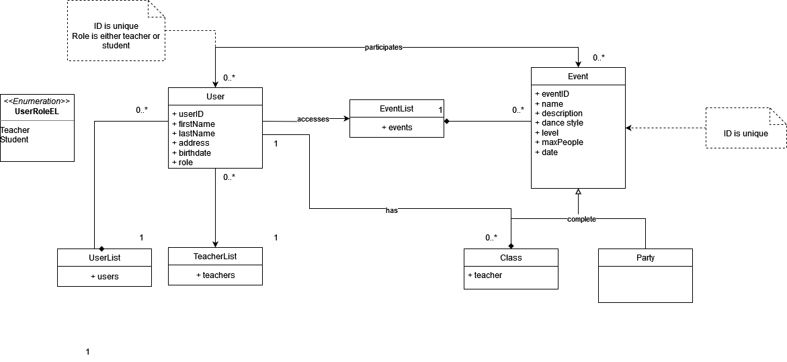

# Business
### Business Name
Dancetastic

### Business Description
It is a small dance studio specializing in social dances, including Salsa, Bachata, Kizomba and Zouk. We provide dance classes and parties for people of all ages and skill levels, aiming to promote the joy of dancing and artistic expression. The classes focus on building technique, musicality and the principles of leading and following. Long term the studio aims to foster a supportive community within the world of dance. 

# App
### App Name
Dancetastic Web

### App Domain Name
dancetastic.com

### App Description
The purpose of the app is to provide both students and teachers an easy access to all classes and parties that are offered by the studio. They should be able to sign up for events directly from the app. The app should have two roles for different users - teacher and student. Both of which should have different rights. For example, a teacher is able to create new events, while a student is not. The app should be backed by a database that is used to persistently save the data of users and events. 

### Design Information Model

### Domain Information Model

### Information Management Tasks
+ Enter the data of a new user: userID, name, address, birthdate
+ Assign role to user: teacher or student
+ Update the data of a user: allow updating all data items except the userID
+ Delete a user: remove user from the database
+ View all users: list all users (accessible only to teachers)
+ View all teachers: list all teachers
+ Enter data for a new event: eventID, name, description, type of event (class or party), dance style, level (1-5), teacher, max number of people, day, time (teachers only)
+ Update data of an event: allow updating everything except the eventID (teachers only)
+ Delete an event: remove an event from the database
+ View all events: list all events and their properties
+ Add user to an event
+ Remove user from an event
+ View all users of an event

